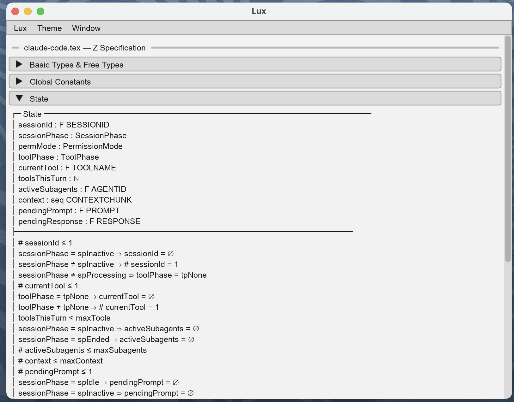

# Z Specification Plugin for Claude Code

> Formal Z specifications and B machines that type-check, animate, and refine --- from English to math to code.

[](LICENSE)
[](https://github.com/punt-labs/z-spec/actions/workflows/docs.yml)
[](./prfaq.pdf)

**Platforms:** macOS, Linux

## What is Z?

[Z](https://en.wikipedia.org/wiki/Z_notation) ("zed") is a formal specification language based on set theory and first-order predicate logic. It was developed at the University of Oxford in the late 1970s and is standardized as [ISO 13568](https://www.iso.org/standard/21573.html).

A Z specification describes a system as:

- **States** --- the data a system holds (e.g., a set of users, a counter, a mode flag)
- **Invariants** --- constraints that must always be true (e.g., `correct ≤ attempts`, `level ≥ 1`)
- **Operations** --- transitions between states, with preconditions and effects

The specification says *what* a system does, not *how*. When a type-checker ([fuzz](https://spivey.oriel.ox.ac.uk/mike/fuzz/)) accepts a spec, the description is internally consistent. When an animator ([ProB](https://prob.hhu.de/)) explores the state space, you see every reachable configuration --- including ones you forgot to think about.

Z's sibling, the [B-Method](https://en.wikipedia.org/wiki/B-Method), extends the same mathematical foundations with a substitution language and a deterministic refinement chain from spec to code. This plugin supports both --- see [B-Method](#b-method-workflow-alpha) below.

### Why use formal specs?

Formal specs catch entire *classes* of bugs mathematically, not just the specific inputs you happened to test. A spec invariant like `¬(radioMode = receiving ∧ toneActive)` makes it structurally impossible to miss the case where keying occurs during receive mode --- no matter how many test cases you write, the invariant covers all of them.

Formal specifications have always caught these bugs. They were too expensive to write by hand --- hours of skilled effort per schema. An LLM drafts the spec; fuzz type-checks it. The methods are the same; the time cost is not.

### Key references

- Spivey, J.M. *[The Z Notation: A Reference Manual](https://spivey.oriel.ox.ac.uk/mike/zrm/)* --- the definitive Z reference
- Abrial, J-R. *[The B-Book: Assigning Programs to Meanings](https://doi.org/10.1017/CBO9780511624162)* --- the definitive B-Method reference, by Z's co-creator
- Bowen, J.P. *[Formal Specification and Documentation using Z](https://doi.org/10.1007/978-1-4471-3553-1)* --- practical applications of Z to real systems
- Simpson, A. *Software Engineering Mathematics* and *State-Based Modelling* --- [University of Oxford](https://www.cs.ox.ac.uk/), Department of Computer Science

## Dependencies

Z Spec orchestrates two established tools that do the mathematical heavy lifting:

- **[fuzz](https://spivey.oriel.ox.ac.uk/mike/fuzz/)** --- Mike Spivey's Z type-checker, developed at Oxford. Verifies that a specification is internally consistent: every schema is well-typed, every reference resolves, every invariant is expressible. Also provides `fuzz.sty` for LaTeX rendering.
- **[ProB](https://prob.hhu.de/)** --- an animator and model-checker from Heinrich Heine University Düsseldorf. Explores the state space of a specification: finds reachable states, checks invariants hold across all transitions, and discovers counter-examples when they don't.

Both are installed automatically by `/z-spec:setup all`. fuzz is compiled from source; ProB is downloaded as a pre-built binary for your platform.

## Ways to Use It

z-spec is one engine — the LaTeX Z parser, the fuzz and probcli wrappers, the
report store — reached through two clients: a `z-spec` CLI and an MCP server. A
given capability runs the same engine code through either client. The Claude
Code plugin is not a third client: its `/z-spec:*` slash commands are LLM
prompts that drive the MCP client. Three ways it gets used:

**1. Claude Code plugin (prompts over the MCP client).** Install the plugin and
drive everything with `/z-spec:*` slash commands. The commands are LLM prompts
that add authoring on top of the engine — generating a spec from a codebase
(`/z-spec:code2model`), deriving TTF partition analyses, explaining a
counter-example — then call the MCP client to type-check, model-check, and
render results in Lux. See [Quick Start](#quick-start).

**2. CLI + MCP without the plugin.** For agents that are not the Claude Code
plugin — Codex, Cursor, or Claude Code under an org policy that blocks plugin
installation — install CLI-only with `--no-plugin`. The `z-spec` CLI and its MCP
server (`z-spec mcp`) expose every deterministic capability. The CLI does not
embed an LLM; the agent authors the artifact itself and passes it to the CLI as
data. A partition or audit report the agent generates is validated and persisted
by piping it in:

```bash
cat analysis.json | z-spec partition spec.tex
```

So a bash-only agent reaches the same partition, audit, type-check, and
model-check results as the plugin, without the plugin. See
[CLI-only install](#quick-start) and [Python Package](#python-package-cli--mcp).

**3. Command line, by hand.** A person at a terminal runs `z-spec check spec.tex`,
`z-spec test spec.tex`, and the rest — the same verbs, no agent, no plugin.
Reports are written as JSON next to the spec; `z-spec show spec.tex` renders them
in Lux.

## Quick Start

```bash
curl -fsSL https://raw.githubusercontent.com/punt-labs/z-spec/c3adc5c/install.sh | sh
```

This installs the `z-spec` CLI and the Claude Code plugin. To install the CLI
only — for non-Claude harnesses (Codex, Cursor, a plain terminal) or where org
policy blocks plugin installation — skip the plugin with `--no-plugin`:

```bash
# flag form (passed through the pipe with sh -s --)
curl -fsSL https://raw.githubusercontent.com/punt-labs/z-spec/c3adc5c/install.sh | sh -s -- --no-plugin

# env form (for argument-hostile contexts: templated CI, proxies)
curl -fsSL https://raw.githubusercontent.com/punt-labs/z-spec/c3adc5c/install.sh | ZSPEC_NO_PLUGIN=1 sh
```

The CLI-only install still sets up uv, Python, the `z-spec` binary, PATH, and
runs `z-spec doctor`; only the marketplace-register and plugin-install steps are
skipped. `ZSPEC_NO_PLUGIN` is honored only when set to exactly `1`. Missing
`claude` or `git` auto-skips the plugin step (the CLI still installs).

<details>
<summary>Manual install (if you already have uv)</summary>

```bash
uv tool install punt-z-spec
claude plugin marketplace add punt-labs/claude-plugins
claude plugin install z-spec@punt-labs
z-spec doctor
```

</details>

<details>
<summary>Verify before running</summary>

```bash
curl -fsSL https://raw.githubusercontent.com/punt-labs/z-spec/c3adc5c/install.sh -o install.sh
shasum -a 256 install.sh
cat install.sh
sh install.sh
```

</details>

Inside Claude Code:

```
/z-spec:setup all                                   # Install fuzz and probcli
/z-spec:code2model the user authentication system   # Generate your first spec
/z-spec:check docs/auth.tex                         # Type-check it
/z-spec:test docs/auth.tex                          # Animate and model-check
```

<details>
<summary>What /z-spec:setup installs</summary>

- **fuzz** --- Z type-checker ([source](https://github.com/Spivoxity/fuzz)), includes `fuzz.sty` for LaTeX
- **probcli** --- ProB CLI for animation and model-checking ([download](https://prob.hhu.de/w/index.php/Download)), requires Tcl/Tk
- **lean** (optional) --- Lean 4 theorem prover for `/z-spec:prove` ([install](https://lean-lang.org/install/))

Setup auto-detects your platform (macOS Intel/Apple Silicon, Linux) and guides you through each install.

</details>

## Python Package (CLI + MCP)

The `punt-z-spec` package provides a CLI and MCP server for programmatic access to Z specification tools.

### Install

```bash
uv tool install punt-z-spec        # CLI only
uv add punt-z-spec                 # As a library dependency
```

### CLI

```bash
z-spec check examples/auth.tex              # Type-check with fuzz, saves .fuzz.json
z-spec test examples/auth.tex               # Full probcli suite, saves .report.json
z-spec animate examples/auth.tex            # Animate only
z-spec model-check examples/auth.tex        # Model-check only
z-spec partition examples/auth.tex          # Validate + persist an authored partition report (JSON on stdin, or --report FILE)
z-spec audit examples/auth.tex              # Validate + persist an authored coverage-audit report (stdin, or --report FILE)
z-spec show examples/auth.tex               # Render the spec and its reports in Lux
z-spec browse tutorial/manifest.toml        # Open a tutorial collection in Lux
z-spec report examples/auth.tex             # Load an existing report
z-spec doctor                               # Check tool availability
z-spec mcp                                  # Start MCP server (stdio)
```

The `partition` and `audit` verbs read the report JSON an agent (or a human)
has authored — from stdin by default, or from a file with `--report FILE`
(`--report -` is stdin). The CLI validates the JSON against the report schema
and persists it; it does not generate the analysis. That authoring is the LLM's
job, done in the plugin's `/z-spec:partition` / `/z-spec:audit` commands or by
any agent driving the CLI.

### MCP Tools

The MCP server (`zspec`) provides 10 tools. Each mirrors a CLI verb and returns
JSON, so a plugin, an agent, and a human at a terminal all reach the same engine:

| Tool | Description |
|------|-------------|
| `check(file)` | Type-check with fuzz, saves `.fuzz.json` |
| `test(file, setsize, max_ops, timeout)` | Full probcli suite, saves `.report.json` |
| `animate(file, steps, setsize)` | Animate only, saves `.report.json` |
| `model_check(file, setsize, max_ops, timeout)` | Model-check only, saves `.report.json` |
| `doctor()` | Report fuzz/probcli presence, version, and health |
| `get_report(file)` | Load an existing ProB report |
| `save_partition_report(file, report_json)` | Validate + persist an authored partition report |
| `save_audit_report(file, report_json)` | Validate + persist an authored coverage-audit report |
| `show_z_spec(file)` | Render the spec and all its reports in Lux |
| `browse(manifest)` | Open a tutorial collection in the paged Lux browser |

Every tool returns `{"ok": true, ...}` on success or `{"ok": false, "error": ...}`
on failure — one convention across all ten. A [PostToolUse hook](hooks/hooks.json)
renders each result as a concise panel rather than raw JSON in the conversation.

### Reports

Reports are saved as JSON alongside `.tex` files:

```text
examples/claude-code.tex               → examples/claude-code.report.json     (ProB)
                                       → examples/claude-code.fuzz.json       (fuzz)
                                       → examples/claude-code.partition.json  (TTF partitions)
                                       → examples/claude-code.audit.json      (test coverage)
```

All reports are gitignored (generated artifacts). `show_z_spec` loads whichever reports exist and renders each as a tab in the lux display.

### Tutorial Browser

The `browse` tool provides a lesson-by-lesson tutorial experience. All lessons are loaded upfront and navigation is instant (client-side). Define a `manifest.toml` with ordered lessons:

```toml
[collection]
title = "Introduction to Z Notation"

[[lessons]]
title = "Basic Types"
spec = "01-basic-types.tex"
annotation = "Z specifications start with **basic types** and **free types**..."
highlights = ["Basic Types"]

[[lessons]]
title = "State Schemas"
spec = "02-state.tex"
annotation = "A **state schema** captures the data a system holds..."
highlights = ["State"]
```

The browser displays a nav bar (Prev/Next buttons + lesson selector), the lesson's didactic annotation, and the full spec tabs (Spec/Fuzz/ProB/Partition/Audit). Section headers matching `highlights` are auto-expanded.

## What It Looks Like

### A generated spec

```latex
\begin{schema}{State}
level : \nat \\
attempts : \nat \\
correct : \nat
\where
level \geq 1 \\
level \leq 26 \\
correct \leq attempts \\
attempts \leq 10000
\end{schema}

\begin{schema}{AdvanceLevel}
\Delta State \\
accuracy? : \nat
\where
accuracy? \geq 90 \\
accuracy? \leq 100 \\
level < 26 \\
level' = level + 1 \\
attempts' = attempts \\
correct' = correct
\end{schema}
```

### A derived partition table

`/z-spec:partition` applies the [Test Template Framework](https://doi.org/10.1007/3-540-48257-1_11) (TTF) to derive conformance test cases directly from the spec's mathematics:

1. **DNF decomposition** --- split disjunctions into independent behavioral branches
2. **Standard partitions** --- type-based equivalence classes (endpoints, midpoints, every constructor)
3. **Boundary analysis** --- values at and around each constraint edge

For the `AdvanceLevel` schema above:

| # | Class | Inputs | Pre-state | Expected |
|---|-------|--------|-----------|----------|
| 1 | Happy path | accuracy=95 | level=5 | level'=6 |
| 2 | Boundary: min accuracy | accuracy=90 | level=5 | level'=6 |
| 3 | Boundary: max level | accuracy=95 | level=25 | level'=26 |
| 4 | Rejected: low accuracy | accuracy=89 | level=5 | no change |
| 5 | Rejected: at max | accuracy=95 | level=26 | no change |

Add `--code swift` (or python, typescript, kotlin) to generate executable test cases.

### Visual exploration with Lux

`show_z_spec` displays the spec directly in a Lux window via `LuxClient` with a Spec tab and, when a valid ProB report is available, also adds ProB and (if a counter-example was found) Counter-Example tabs. The Spec tab renders the Z model with collapsible section headers. The ProB tab shows states explored, transitions covered, checks passed, and operation coverage. If a counter-example is found, a third tab shows the trace as a step-by-step table with state values and the violated invariant. If Lux is not running, it degrades gracefully with an error status.



*A Z specification rendered in Lux --- collapsible sections for state schemas, invariants, and global constants. The display updates live as the spec evolves.*

## Features

- **Generate Z specs** from codebase analysis or system descriptions (`/z-spec:code2model`)
- **Type-check** with fuzz (`/z-spec:check`)
- **Animate and model-check** with probcli (`/z-spec:test`)
- **Derive test cases** from specs using TTF testing tactics (`/z-spec:partition`)
- **Generate code and tests** from specifications (`/z-spec:model2code`)
- **Audit test coverage** against spec constraints (`/z-spec:audit`)
- **Generate Lean 4 proof obligations** for machine-checked correctness (`/z-spec:prove`)
- **Generate runtime contracts** (preconditions, postconditions, invariants) from specs (`/z-spec:contracts`)
- **Property-based testing** with Lean model as oracle (`/z-spec:oracle`)
- **Data refinement verification** via abstraction function commutativity (`/z-spec:refine`)
- **Elaborate** specs with narrative from design documentation (`/z-spec:elaborate`)
- **ProB-compatible** output (avoids B keyword conflicts, bounded integers, flat schemas)
- **B-Method support** (alpha) --- create, type-check, animate, and refine B machines (`/z-spec:b-create`, `/z-spec:b-check`, `/z-spec:b-animate`, `/z-spec:b-refine`)

## Commands

### Setup

| Command | Description |
|---------|-------------|
| `/z-spec:setup [check\|fuzz\|probcli\|all]` | Install and configure fuzz and probcli |
| `/z-spec:doctor` | Check environment health |
| `/z-spec:help` | Show quick reference |
| `/z-spec:cleanup [dir]` | Remove TeX tooling files (keeps .tex and .pdf) |

### Z Specification

| Command | Description |
|---------|-------------|
| `/z-spec:code2model [focus]` | Create a Z spec from codebase or description |
| `/z-spec:check [file]` | Type-check with fuzz |
| `/z-spec:test [file] [-v] [-a N] [-s N]` | Animate and model-check with probcli |
| `/z-spec:elaborate [spec] [design]` | Enhance spec with narrative from design docs |
| `/z-spec:prove [spec] [--obligations=all\|init\|preserve] [--no-mathlib]` | Generate Lean 4 proof obligations |
| `/z-spec:partition [spec] [--code [language]] [--operation=NAME] [--json]` | Derive test cases using TTF testing tactics |
| `/z-spec:model2code [spec] [language]` | Generate code and tests from spec |
| `/z-spec:contracts [spec] [language] [--invariants-only] [--wrap] [--strip]` | Generate runtime assertion functions |
| `/z-spec:oracle [spec] [language] [--sequences N] [--steps N]` | Property-based testing with Lean model as oracle |
| `/z-spec:refine [spec] [language] [--lean] [--generate-abstraction] [--impl file]` | Verify code refines spec via abstraction function |
| `/z-spec:audit [spec] [--json] [--test-dir=DIR]` | Audit test coverage against spec constraints |

### B-Method (alpha)

| Command | Description |
|---------|-------------|
| `/z-spec:b-create [description or file.tex]` | Create a B machine or translate Z spec to B |
| `/z-spec:b-check [machine.mch]` | Type-check with probcli |
| `/z-spec:b-animate [machine.mch]` | Animate and model-check with probcli |
| `/z-spec:b-refine [machine.mch] [refinement.ref]` | Create or verify a refinement |

## Workflow

```
/z-spec:setup                              # Install tools (first time only)
/z-spec:doctor                             # Verify environment health
/z-spec:code2model the payment system      # Generate spec from codebase
/z-spec:check docs/payment.tex             # Type-check
/z-spec:test docs/payment.tex              # Animate and model-check
/z-spec:partition docs/payment.tex         # Derive test cases from spec
/z-spec:partition docs/payment.tex --code  # Generate executable test code
/z-spec:prove docs/payment.tex             # Generate Lean 4 proof obligations
/z-spec:contracts docs/payment.tex         # Generate runtime assertion functions
/z-spec:oracle docs/payment.tex            # Property-based testing vs Lean model
/z-spec:refine docs/payment.tex            # Verify code refines spec
/z-spec:elaborate docs/payment.tex         # Add narrative from DESIGN.md
/z-spec:model2code docs/payment.tex swift  # Generate Swift code and tests
/z-spec:audit docs/payment.tex             # Audit test coverage against spec
/z-spec:cleanup                            # Remove tooling files when done
```

### B-Method Workflow (alpha)

The [B-Method](https://en.wikipedia.org/wiki/B-Method) was created by Jean-Raymond Abrial, who also co-created Z. It shares Z's mathematical foundations --- set theory, predicate logic, schemas --- but adds two things Z deliberately omits: a **substitution language** for describing how operations change state (assignments, conditionals, loops), and a **first-class refinement chain** that carries a specification through three stages: Abstract Machine (`.mch`) → Refinement (`.ref`) → Implementation (`.imp`). Each stage is verified against the previous one.

This plugin supports two paths from specification to code:

| | B Refinement | Z + LLM |
|---|---|---|
| **Method** | Deterministic --- proof obligations at each step | Probabilistic --- LLM translates, verification tools check |
| **Guarantee** | Proven correct by construction | Empirical confidence through layered verification |
| **Verification** | Machine-checked proofs (probcli) | Type-checking, model-checking, partition tests, runtime contracts, oracle PBT, abstraction function commutativity |
| **Cost** | Requires writing refinement and gluing invariants | Seconds to generate, but correctness is not proven |

Both paths start from the same place: a formal specification with precise invariants and preconditions. Without a spec, there is no mathematical definition of "correct" to check against. With one, every generated artifact --- code, tests, contracts, proofs --- can be verified against it.

B support is alpha --- the commands work with probcli (no additional tools required) but have not been tested across a wide range of specifications.

```
/z-spec:b-create A user registry with add and remove  # Create B machine
/z-spec:b-check specs/registry.mch                    # Type-check
/z-spec:b-animate specs/registry.mch                  # Animate and model-check
/z-spec:b-refine specs/registry.mch                   # Create refinement machine
/z-spec:b-refine specs/registry.mch specs/registry_r.ref  # Verify refinement
```

Or translate an existing Z spec to B:

```
/z-spec:b-create docs/registry.tex                    # Z-to-B translation
```

<details>
<summary>Reference: ProB compatibility</summary>

The plugin generates specs that work with both fuzz and probcli:

| Issue | Solution |
|-------|----------|
| B keyword conflict | Use `ZBOOL ::= ztrue \| zfalse` |
| Abstract functions | Provide concrete mappings |
| Unbounded integers | Add bounds in invariants |
| Nested schemas | Flatten into single State schema |
| Unbounded inputs | Add upper bounds to inputs |

</details>

<details>
<summary>Reference: spec structure</summary>

Generated specs follow this structure:

1. **Basic Types** --- Given sets (`[USERID, TIMESTAMP]`)
2. **Free Types** --- Enumerations (`Status ::= active | inactive`)
3. **Global Constants** --- Configuration values
4. **State Schemas** --- Entities with invariants
5. **Initialization** --- Valid initial states
6. **Operations** --- State transitions
7. **System Invariants** --- Key properties summary

</details>

## Development

<details>
<summary>Dev/prod namespace isolation</summary>

The working tree is the dev plugin: `plugin.json` has `name: "z-spec-dev"` and
its MCP server runs the working tree via
`uv run --directory ${CLAUDE_PLUGIN_ROOT} z-spec mcp`. The marketplace release is
the prod plugin: `name: "z-spec"` with the MCP server invoking the installed
`z-spec` binary. The two names differ, so both load at once — you get production
commands and working-tree commands side by side.

| Source | Commands | MCP tools | What they run |
|--------|----------|-----------|---------------|
| Marketplace `z-spec` | `/z-spec:check`, `/z-spec:test`, ... | `mcp__plugin_z-spec_zspec__*` | Installed `z-spec` binary |
| Local `z-spec-dev` | `/z-spec-dev:check-dev`, `/z-spec-dev:test-dev`, ... | `mcp__plugin_z-spec-dev_zspec__*` | Working tree (`uv run`) |

The `-dev` command twins are generated, not hand-written. Every prod command
`commands/<c>.md` has a `commands/<c>-dev.md` twin that is identical except its
MCP tool references gain the `-dev` plugin suffix and its `/z-spec:<cmd>`
self-references become `/z-spec-dev:<cmd>-dev`. Regenerate them after editing any
prod command:

```bash
make gen-dev-commands     # rewrite the twins from prod sources
make check-dev-commands   # fail if any twin is missing or stale (part of `make check`)
```

**Local test.** From the repo root, with the working tree in dev state:

```bash
uv sync                   # 1. install the working-tree z-spec into the project venv
claude --plugin-dir .     # 2. launch Claude Code loading z-spec-dev alongside z-spec
/z-spec-dev:check-dev docs/account.tex   # 3. run a dev command against the working tree
```

`/z-spec-dev:*` commands and their `mcp__plugin_z-spec-dev_zspec__*` tools exercise
the code in the working tree; the marketplace `/z-spec:*` commands stay on the
installed release. Nothing is published — the dev plugin is loaded only for that
session.

</details>

<details>
<summary>Release flow</summary>

`release-plugin.sh` performs three swaps in one commit: the plugin name
(`z-spec-dev` → `z-spec`), the MCP server command (`uv run` working tree → the
installed `z-spec` binary, so marketplace users without a uv project can run it),
and it strips the `-dev` command twins. `restore-dev-plugin.sh` restores all three
by checking out `plugin.json` and `commands/` from the parent of the release-prep
commit.

```bash
# 1. Prepare release (swaps name + MCP command to prod, removes -dev commands)
bash scripts/release-plugin.sh

# 2. Tag the release — the tag must point at the prod-named commit
git tag v0.1.0
git push origin v0.1.0

# 3. Restore dev state on main
bash scripts/restore-dev-plugin.sh
git push origin main
```

Both scripts abort if the working tree has uncommitted changes.

</details>

<details>
<summary>Project structure</summary>

```
.claude-plugin/
  plugin.json           # Plugin manifest (name: z-spec-dev in working tree)
commands/
  check.md              # /z-spec:check (prod)
  check-dev.md          # /z-spec-dev:check-dev (dev)
  b-check.md            # /z-spec:b-check (prod, B-Method)
  b-check-dev.md        # /z-spec-dev:b-check-dev (dev, B-Method)
  ...                   # One prod + one dev variant per command
scripts/
  release-plugin.sh     # Swap to prod name + MCP command, remove -dev commands
  restore-dev-plugin.sh # Restore dev state after tagging
tools/
  gen_dev_commands.py   # Generate/verify the commands/*-dev.md twins
reference/
  z-notation.md         # Z notation cheat sheet
  schema-patterns.md    # Common patterns and ProB tips
  probcli-guide.md      # probcli command reference
  b-notation.md         # B-Method notation reference
  b-machine-patterns.md # B machine patterns and Z-to-B translation
templates/
  preamble.tex          # LaTeX preamble for generated specs
```

</details>

## Thanks

- [@ebowman](https://github.com/ebowman) --- `/z-spec:partition`, `/z-spec:prove`, `/z-spec:contracts`, `/z-spec:oracle`, and `/z-spec:refine` commands

## License

MIT License --- see [LICENSE](LICENSE)
